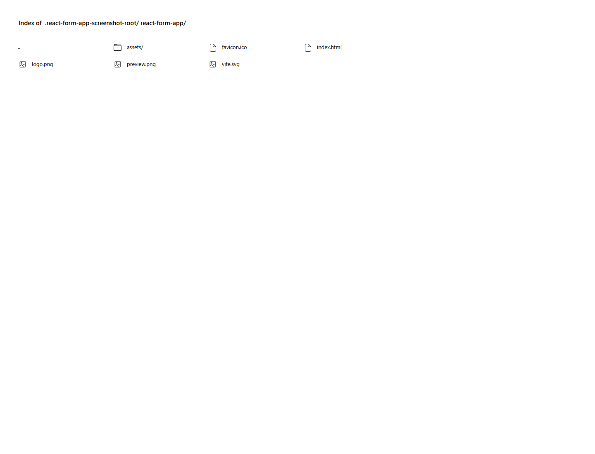

# React Form App

A responsive React and Vite form for collecting validated profile data, checking resume uploads, reviewing a submission and exporting the result.

## Features

- Field validation for names, email, phone number, URL and required choices
- Resume upload checks for PDF and DOC files under 2 MB
- Submission summary modal with JSON and PDF export
- Reset control, inline errors and toast feedback
- Responsive Material UI layout with a fixed header and icon-only footer
- Floating go-to-top control with smooth scrolling

## Tech stack

React, Vite, Material UI, styled-components, react-icons, react-toastify and jsPDF.

## Run locally

npm install
npm run dev

Build and deploy:

npm run build
npm run deploy

## Deployment

Live: https://a2rp.github.io/react-form-app/

## Links

- Portfolio: https://www.ashishranjan.net/
- GitHub: https://github.com/a2rp
- CodePen: https://codepen.io/ash1198
- LinkedIn: https://www.linkedin.com/in/aashishranjan
- Facebook: https://www.facebook.com/theash.ashish/
- YouTube: https://www.youtube.com/@ashishranjan-ashz?sub_confirmation=1
- Email: mailto:ash.ranjan09@gmail.com

## Support

- Support: https://a2rp-donation-page.netlify.app/
- Buy Me a Coffee: https://buymeacoffee.com/a2rp
- Patreon: https://patreon.com/a2rp
